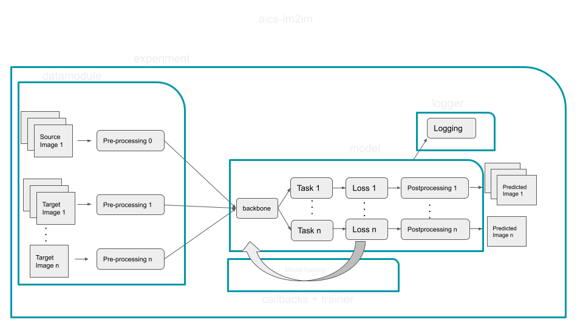

<div align="center">

# cyto-dl

<a href="https://pytorch.org/get-started/locally/"></a>
<a href="https://pytorchlightning.ai/"></a>
<a href="https://hydra.cc/"></a>
<a href="https://github.com/ashleve/lightning-hydra-template"></a><br>

<!--[](https://www.nature.com/articles/nature14539)
[](https://papers.nips.cc/paper/2020) -->

</div>

<p align="center">
  
</p>

## Description

In an effort to spend more work on methods development, simplify maintenance,
and create a unified framework for all of AICS's deep learning tools, we have
created `cyto-ml`. As the underlying framework is based on [lightning-hydra-template](https://github.com/ashleve/lightning-hydra-template), we recommend that you familiarize yourself with their (short) docs for detailed instructions on running training, overrides, etc.

## How to run

Install dependencies

```bash
# clone project
git clone https://github.com/AllenCellModeling/cyto-dl
cd cyto-dl

# [OPTIONAL] create conda environment
conda create -n myenv python=3.9
conda activate myenv

pip install -r requirements/linux/requirements.txt

# [OPTIONAL] install extra dependencies - equivariance related
pip install -r requirements/linux/equiv-requirements.txt

pip install -e .


#[OPTIONAL] if you want to use default experiments on example data
python scripts/download_test_data.py
```

Train model with chosen experiment configuration from [configs/experiment/](configs/experiment/)

```bash
#gpu
python cyto_dl/train.py experiment=im2im/experiment_name.yaml trainer=gpu

#cpu
python cyto_dl/train.py experiment=im2im/experiment_name.yaml trainer=cpu

```

You can override any parameter from command line like this

```bash
python cyto_dl/train.py trainer.max_epochs=20 datamodule.batch_size=64
```
